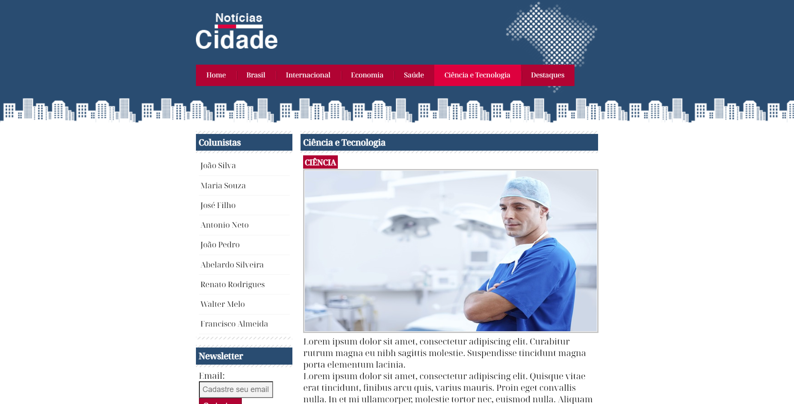

# Projeto Site de Noticias

Projeto módulo de CSS3 avançado do curso Desenvolvimento Web 2022 da UDEMY.

Página em HTML . 7 páginas. 

Abordagem de seletores CSS, herança e especificidade, barras de navegação, layouts, estilização de formulários, listas, tabelas.

Fonte: Noto Serif Display by google fonts.

Imagens banco de dados gratuito pexels . Autores: Tim Samuel, Tima Miroshivchenko, Edgars Ksuro, Josh Sorenson, Peng Liu, Edward Jenner, Tembela Bohle. Além do material cedido pelo curso.

Página 01 -HOME

Página 02 - Brasil

Página 03 - Internacional

Página 04 - Saúde

Página 05 -Economia

Página 06 - Ciencia e Tecnologia

Página 07 - Destaques
